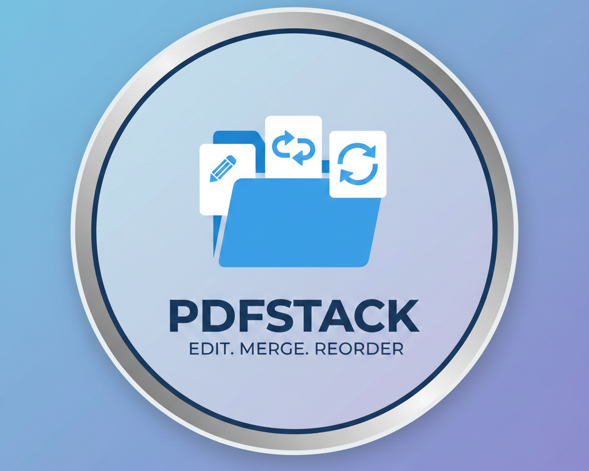

# PDF Manager

A lightweight desktop application for merging, reordering, rotating, and managing PDF documents. Built with Rust and Slint UI.



## Features

- **Load multiple PDFs** — Add one or more PDF files at once
- **Page previews** — Thumbnail previews for every page
- **Drag-and-drop reorder** — Rearrange pages by dragging the handle
- **Rotate pages** — Rotate any page by 90° increments
- **Delete pages** — Remove unwanted pages
- **Merge & export** — Combine all pages into a single PDF
- **Error dialogs** — In-app error messages instead of console output

## Dependencies

### System libraries

This project depends on the following native libraries:

- **poppler** (with glib bindings) — PDF rendering
- **cairo** — 2D graphics
- **pkg-config** — build-time dependency resolution

#### Arch Linux

```sh
sudo pacman -S poppler-glib cairo pkg-config
```

#### Ubuntu / Debian

```sh
sudo apt install libpoppler-glib-dev libcairo2-dev pkg-config
```

#### Fedora

```sh
sudo dnf install poppler-glib-devel cairo-devel pkg-config
```

### Rust toolchain

Requires Rust 1.70+ with Cargo. Install via [rustup](https://rustup.rs/).

## Building

### Debug build

```sh
cargo build
```

### Release build (Linux)

```sh
cargo build --release
```

The optimized binary will be at `target/release/pdf-manager`.

### Release build (Windows)

On a Windows machine with MSVC toolchain:

```sh
cargo build --release
```

The console window is suppressed automatically via `#![windows_subsystem = "windows"]`. The application icon and metadata are embedded using `winresource`.

## Running

```sh
cargo run --release
```

Or run the binary directly:

```sh
./target/release/pdf-manager
```

## Usage

1. Click **Add Files** to load one or more PDF files
2. Drag the handle (dots) on any page card to reorder
3. Click the rotate icon to rotate a page 90°
4. Click the trash icon to remove a page
5. Click **Convert** to save the merged result as a new PDF
6. Click **Clear** to remove all loaded pages

## Tech Stack

- [Rust](https://www.rust-lang.org/) — Language
- [Slint](https://slint.dev/) — UI framework
- [lopdf](https://github.com/nicksrandall/lopdf) — PDF manipulation
- [poppler](https://poppler.freedesktop.org/) — PDF page rendering
- [cairo](https://www.cairographics.org/) — 2D rendering backend
- [rfd](https://github.com/PolyMeilex/rfd) — Native file dialogs

## License

This project is provided as-is. See the source code for details.
